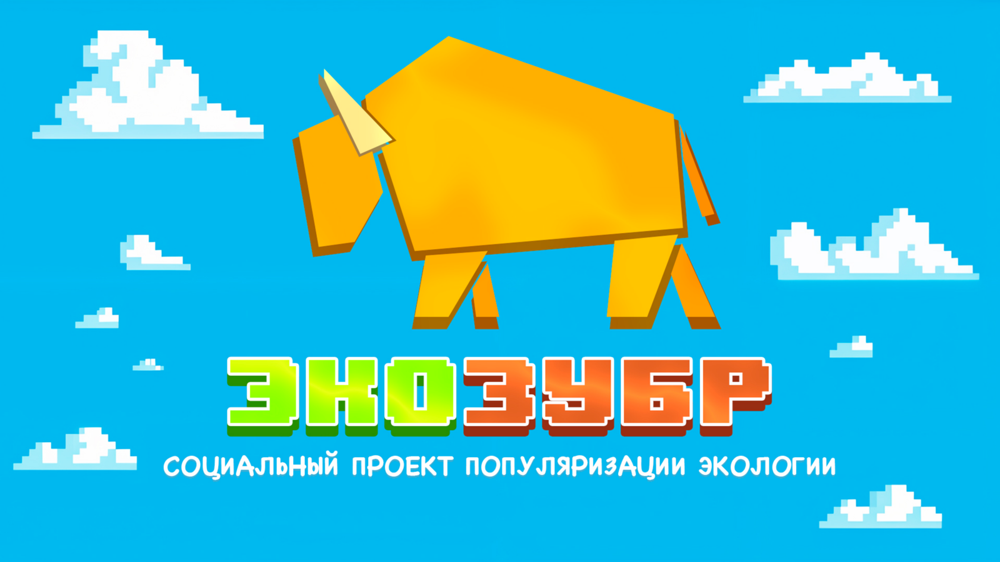
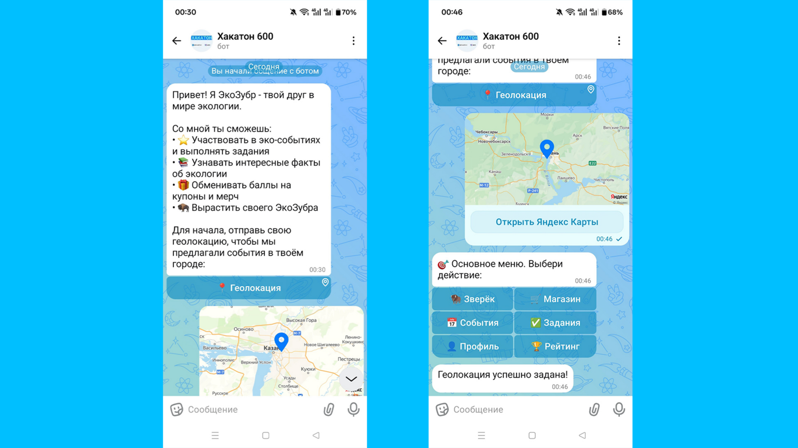
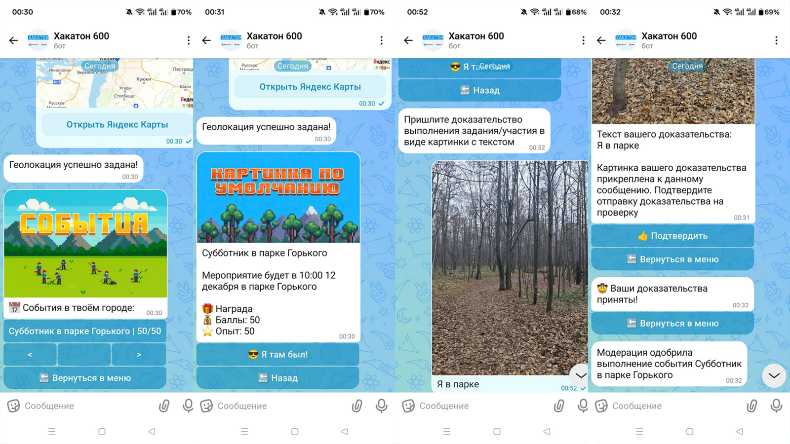
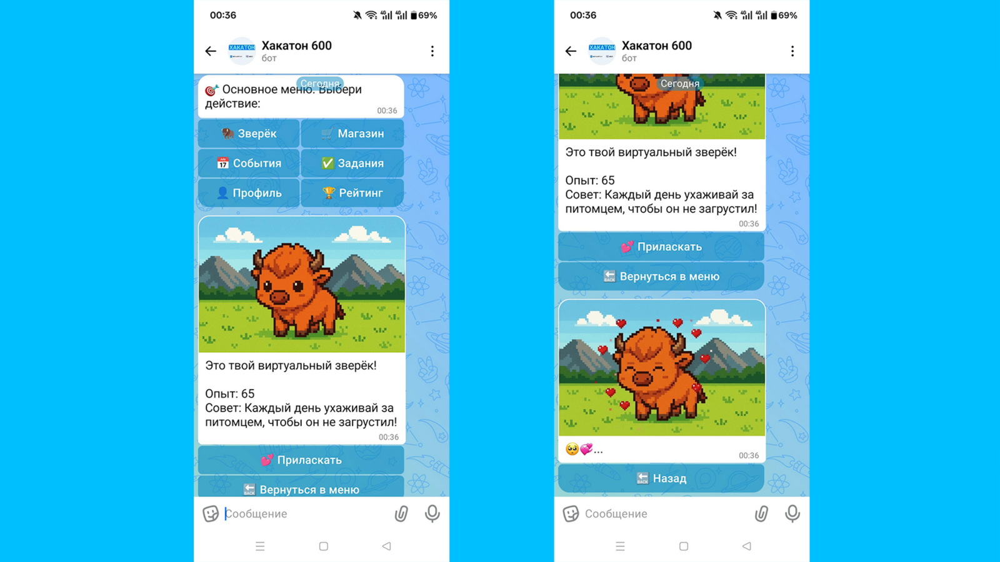
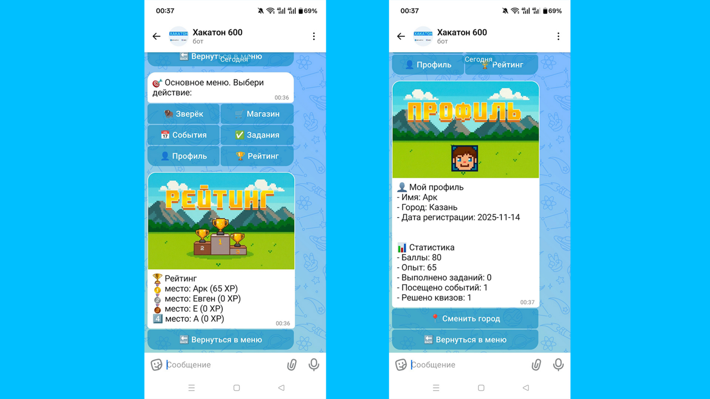

# Eco Zubr Bot



> Совместный проект с [@ZhenShenITIS](https://github.com/ZhenShenITIS).

Чат-бот мессенджера MAX, который превращает эко-активизм в игру: пользователи находят мероприятия в своём городе, выполняют эко-задания, зарабатывают баллы и обменивают их на реальные награды.

Проект вырос из исследования команды: 84% молодёжи интересуются экологией, но реально участвуют в эко-мероприятиях лишь 12% — «ЭкоЗубр» закрывает этот разрыв геймификацией (баллы, питомец, рейтинг) и низким порогом входа: всё происходит прямо в мессенджере.

[Презентация проекта](https://disk.360.yandex.ru/i/MgaQwiw2G-aTsg)

## Демо

Первое знакомство: бот определяет город по геолокации и показывает основное меню.



События и задания с фото-доказательствами и модерацией.



Виртуальный зверёк, рейтинг и профиль со статистикой.




## Описание

«ЭкоЗубр» — виртуальный зверёк-компаньон, вокруг которого построена геймификация экологической активности. Бот работает на Long Poll API мессенджера MAX: принимает апдейты, ведёт конечный автомат состояний каждого пользователя и обрабатывает нажатия inline-кнопок на виртуальных потоках (Java 21 virtual threads). Контент (задания, события, награды, викторины) хранится в PostgreSQL и пополняется через админ-команду и автозаполнение БД из JSON.

## Возможности

- **Эко-события по городу.** Пользователь отправляет геолокацию, бот определяет город через Яндекс-Геокодер и показывает список событий рядом.
- **Задания с модерацией.** Пользователь берёт эко-задание, отправляет фото-доказательство выполнения, задание проходит модерацию и начисляет баллы.
- **Магазин наград.** Баллы обмениваются на купоны и мерч; учёт остатков наград (закончилась — не продаётся).
- **Виртуальный зверёк.** Питомец растёт по опыту, за ним нужно ухаживать (прогресс и «сердечки» на стадиях).
- **Викторина об экологии.** Вопросы с вариантами ответов, сохранение ответов пользователей.
- **Рейтинг участников.** Таблица лидеров по баллам.
- **Рассылки.** Массовая отправка сообщений всем пользователям, в том числе по таймеру, с предварительной модерацией контента.
- **Админ-функции.** Команда `/add_content` добавляет задания/события/награды из JSON с картинкой; при пустой БД контент заполняется автоматически из JSON-файлов.
- **Профиль.** Баллы, статистика, смена города.

## Технологии

- Java 21 (виртуальные потоки для обработчиков апдейтов)
- Spring Boot 3.5.7 (Web, Data JPA, Hibernate)
- PostgreSQL (схема создаётся Hibernate `ddl-auto=update`, первичная инициализация — `init-db.sql`)
- MAX Bot SDK `0.0.6-SNAPSHOT` и MAX Bot API Client (Long Poll API)
- Lombok, Guava 33.3.1, org.json
- Maven, Spotless (Palantir Java Format), Docker (multi-stage сборка), Docker Compose

## Запуск

### 1. Клонируйте репозиторий

```bash
git clone https://github.com/damirkuz/eco-zubr-bot.git
cd eco-zubr-bot
```

### 2. Создайте `.env` в корне проекта

```bash
cp .env.example .env
```

Заполните переменные:

- `MAX_TOKEN` — токен бота из MAX Bot Platform;
- `YANDEX_GEOCODER_TOKEN` — ключ HTTP-Геокодера Яндекса ([получить](https://developer.tech.yandex.ru/): «Подключить API» → «HTTP Геокодер»);
- `DB_USER`, `DB_PASSWORD`, `DB_NAME`, `DB_HOST`, `DB_PORT` — параметры БД. Значения по умолчанию из `.env.example` работают без ручной настройки: Docker Compose поднимет PostgreSQL и `init-db.sql` создаст пользователя и базу.

### 3. Соберите и запустите контейнеры

```bash
docker-compose up -d --build
docker-compose logs -f app
```

### 4. Остановка

```bash
docker-compose down      # остановить
docker-compose down -v   # остановить и удалить данные БД
```

Локальная разработка без Docker: заполните `src/main/resources/application.properties` (шаблон — `application.properties.example`) и запустите `./mvnw spring-boot:run`.

## Структура проекта

```text
src/main/java/itis/ecozubrbot/
├── max/              ядро бота: Long Poll, команды, callbacks, состояния (FSM)
│   ├── callbacks/    обработчики inline-кнопок (задания, события, магазин, зверёк…)
│   ├── commands/     /menu, /help, /add_content
│   └── states/       состояния пользователя (загрузка фото, геолокация, модерация…)
├── services/         бизнес-логика: события, задания, награды, зверёк, рейтинг
├── newsletter/       рассылки, в том числе по таймеру
├── quiz/             викторина об экологии
├── models/           JPA-сущности (User, Challenge, Event, Reward, Pet, Quiz…)
├── repositories/     Spring Data JPA + in-memory реализации
├── config/           конфигурация бота и команд
└── fillsql/          автозаполнение БД контентом из JSON
```
